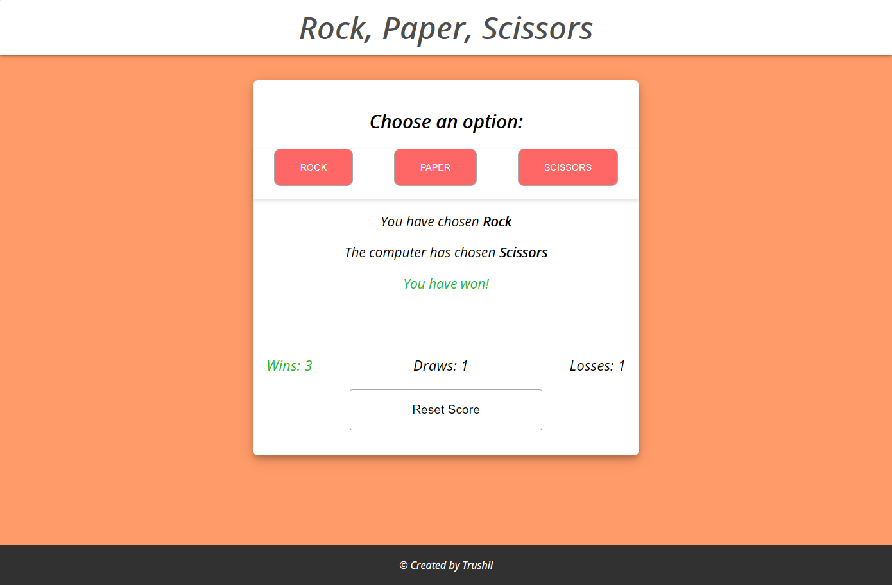

# Rock, Paper, Scissors - JavaScript

## 📖Table of Contents
1. [Description](#description)
2. [Link](#Link)
3. [Screenshots](#Screenshots)
4. [Technologies](#Technologies)
5. [Contributing](#Contributing)
6. [Author](#Author)
7. [License](#License)

## Description

A game of Rock, Paper, Scissors against an automated opponent. Upon making a selection, the game will run and display the result.

The game will track the number of wins, losses and draws for the user.

The user will also have the option to reset the scoreboard if they wish to do so.

## Link

The link to the deployed application:

Code Quiz: https://trushilbudhia.github.io/Rock-Paper-Scissors-JavaScript/

## Screenshots

The following images show the web application's appearance:

## Technologies
- JavaScript
- HTML
- CSS

## Contributing
Contributions, issues and feature requests are welcome.

Feel free to check [issues page](https://github.com/TrushilBudhia/Rock-Paper-Scissors-JavaScript/issues) if you want to contribute.

## Author
👤Trushil Budhia
- Github: [@Trushil](https://github.com/TrushilBudhia)
- Email: trushil.budhia@gmail.com

## License
Copyright © 2021 [Trushil](https://github.com/TrushilBudhia)

This project is [MIT](./LICENSE) licensed

